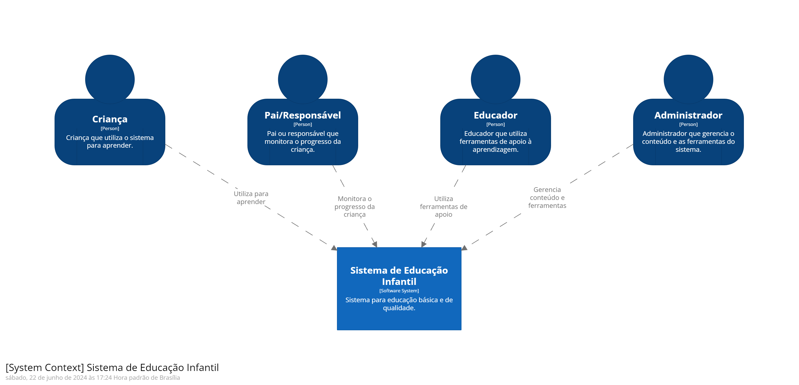
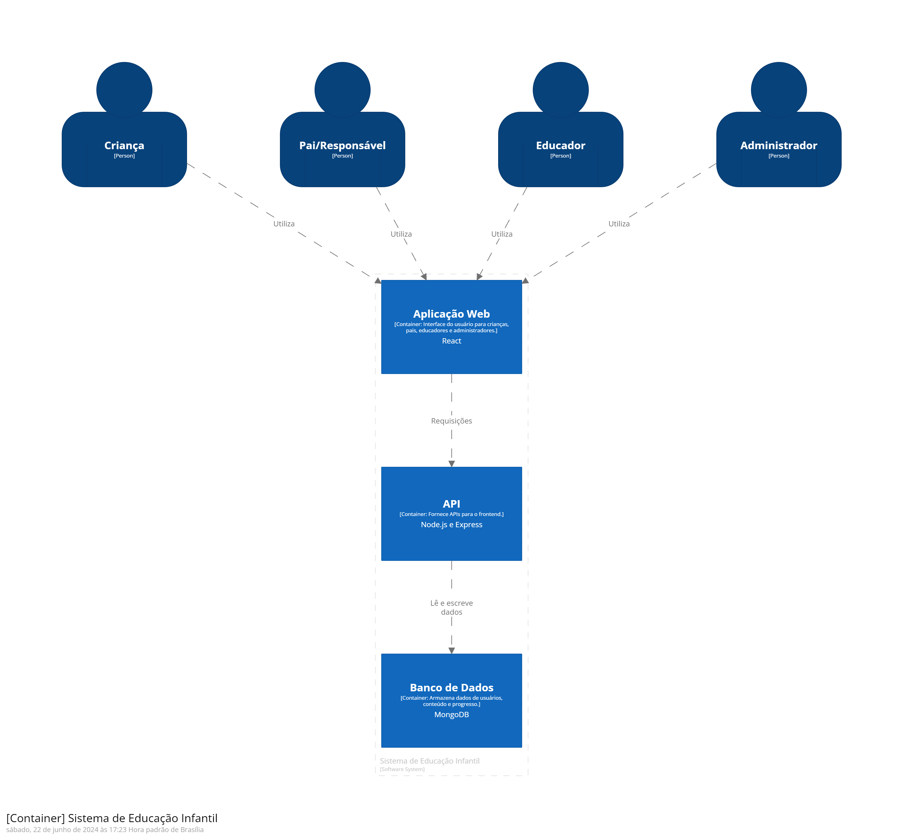
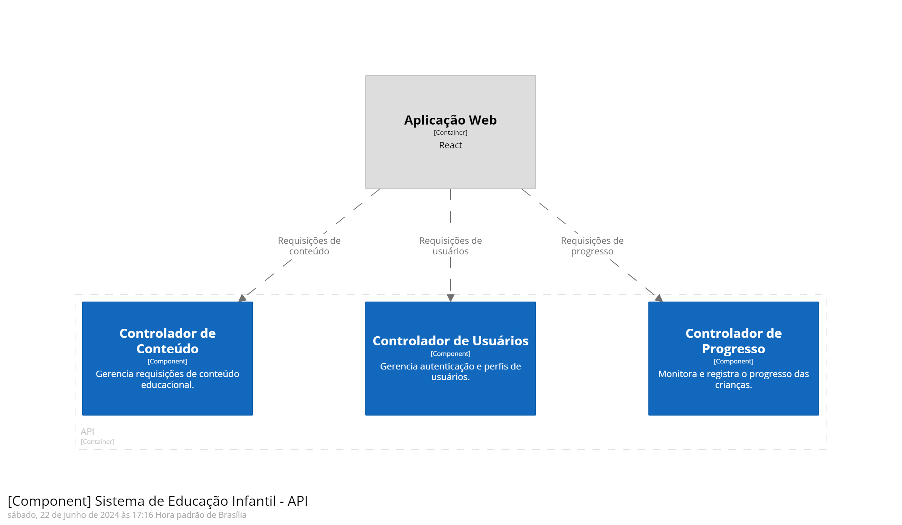

# Arquitetura do Projeto

## Escolhas de Tecnologias

As tecnologias foram escolhidas com base nos requisitos funcionais e não funcionais do sistema, visando garantir performance, escalabilidade, usabilidade e segurança.

### Frontend
- **React**: Biblioteca JavaScript para construção de interfaces de usuário interativas e dinâmicas.
- **Bootstrap**: Framework de CSS para estilização rápida e responsiva.
  
### Backend
- **Node.js**: Ambiente de execução JavaScript para construção de aplicações de rede escaláveis.
- **Express.js**: Framework minimalista para criação de APIs robustas e flexíveis.
  
### Banco de Dados
- **MongoDB**: Banco de dados NoSQL para armazenamento flexível e escalável de dados não estruturados.

## Projeto Arquitetural Elaborado

A arquitetura do sistema foi modelada utilizando o C4 Model, que divide a representação arquitetural em quatro níveis:

### Diagrama de Contexto

### Diagrama de Container

### Diagrama de Componentes

## Justificativa do Modelo Escolhido

O C4 Model foi escolhido por sua clareza e capacidade de representar diferentes níveis de abstração do sistema. Ele facilita a comunicação entre stakeholders técnicos e não técnicos, proporcionando uma visão clara e estruturada da arquitetura. A divisão em containers e componentes permite uma melhor organização e manutenção do sistema, além de facilitar a escalabilidade e a adição de novas funcionalidades no futuro.
